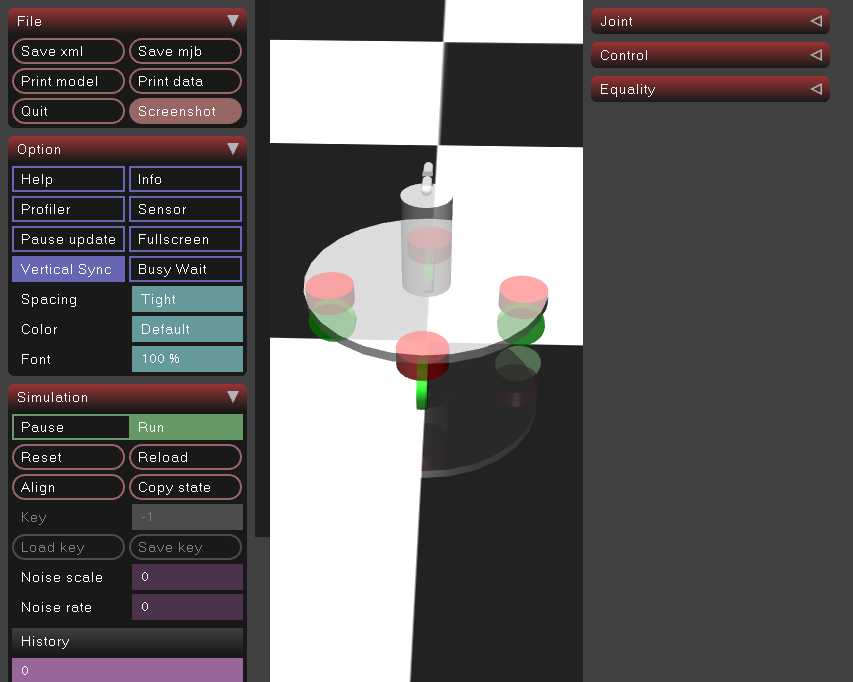

## 舵轮简单仿真



> 后续会把麦轮和全向也加入。

### 文件
```bash
-- robot            # 舵轮带小云台
    -- controller.py  # 控制器
    -- scence.xml     # 仿真文件
    -- ...
-- steerwheel       # 舵轮底盘
    -- controller.py  # 控制器
    -- scence.xml     # 仿真文件
```

### 启动
``` bash
cd robot
python3 controller.py
```